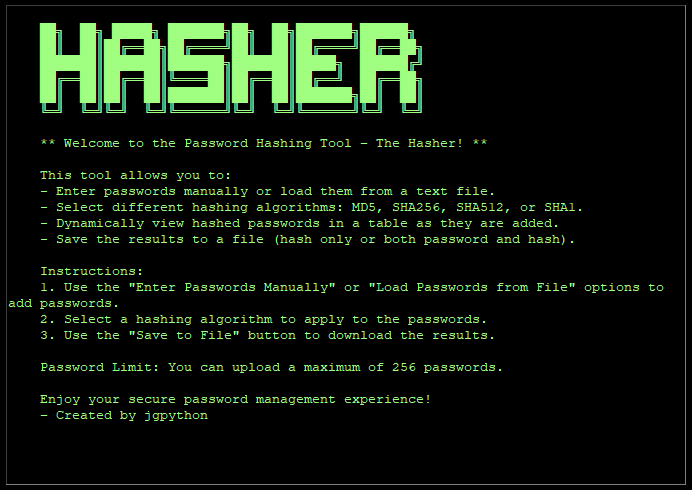
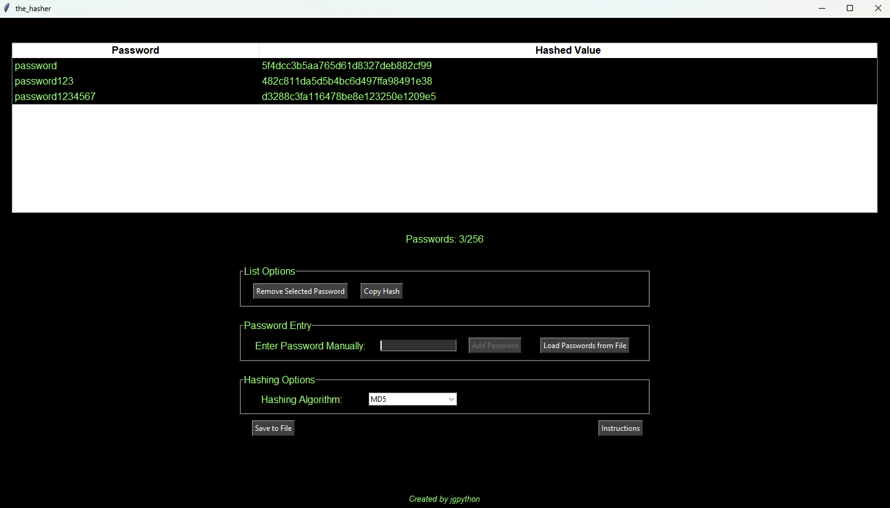

# The Hasher

    ██╗  ██╗ █████╗ ███████╗██╗  ██╗███████╗██████╗ 
    ██║  ██║██╔══██╗██╔════╝██║  ██║██╔════╝██╔══██╗
    ███████║███████║███████╗███████║█████╗  ██████╔╝
    ██╔══██║██╔══██║╚════██║██╔══██║██╔══╝  ██╔══██╗
    ██║  ██║██║  ██║███████║██║  ██║███████╗██║  ██║
    ╚═╝  ╚═╝╚═╝  ╚═╝╚══════╝╚═╝  ╚═╝╚══════╝╚═╝  ╚═╝

# The Hasher

**The Hasher** is a Python-based password hashing tool designed to help users securely hash passwords using well-known cryptographic hashing algorithms such as MD5, SHA256, SHA512, and SHA1. It provides an intuitive GUI built with Tkinter, allowing users to manually enter passwords or load them from a text file, hash them using a selected algorithm, and save the results for future use.

## Features

- **Manual Password Entry**: Users can enter passwords one by one for hashing.
- **File-based Password Loading**: Load multiple passwords from a text file for batch processing.
- **Hashing Algorithms**: Supports MD5, SHA256, SHA512, and SHA1.
- **Dynamic Table**: View and manage passwords and their corresponding hash values in a dynamic table.
- **Save to File**: Save hashed results (either just the hash or both password and hash) to a file for easy record-keeping.

## Versions

### Tkinter Version

This is a desktop application built using **Tkinter**, allowing users to interact with the hashing tool through a simple GUI.

### Flask Version

The **Flask version** provides a modern web-based interface for hashing passwords, making the tool more accessible through a browser. However, this version currently **does not support file saving or uploading passwords from a file**. It is ideal for quick password hashing tasks directly in the browser.

## How to Use

### Option 1: Tkinter Version (Desktop)

1. Clone this repository to your local machine:
   
`git clone https://github.com/jgpython/the_hasher.git`

2. Navigate to the repository:
`cd the_hasher`

3. Run the app:
`python the_hasher.py`

### Option 2: Flask Version (Web)

1. Clone the Repository:
`git clone https://github.com/jgpython/the_hasher.git`

2. Navigate to the Flask Version:
`cd the_hasher/the_hasher_flask`

3. Install Flask (if not already installed):
`pip install Flask`

4. Run the Flask App:
`python the_hasher_flask.py`

5. Access the Application:
`Open your web browser and navigate to http://127.0.0.1:5000/`

## Requirements
- Python 3.x is required to run the script.
- Flask (for the web-based version) can be installed with: `pip install Flask`

## Cybersecurity Implications

**The Hasher** tool demonstrates fundamental principles of password security and hashing. Here are the key cybersecurity implications:

### Password Hashing
Password hashing is a critical cybersecurity practice for protecting sensitive information. Hashing transforms passwords into fixed-length strings (hashes) that cannot be easily reversed, ensuring that passwords are not stored in plaintext.

### Cryptographic Hash Algorithms
This tool uses several widely-known cryptographic hash functions:

- **MD5**: Fast but considered insecure for storing passwords due to known vulnerabilities such as collisions.
- **SHA1**: Also considered insecure due to vulnerabilities that can lead to hash collisions.
- **SHA256 and SHA512**: Secure cryptographic hashing algorithms that are recommended for modern password storage.

> **Note**: While MD5 and SHA1 are included for demonstration purposes, they should **not** be used in production environments due to their security flaws. SHA256 or SHA512 should be preferred for secure hashing.

### Password Storage Best Practices
Although the tool hashes passwords, for real-world use, additional security measures should be implemented, such as:

- **Salting**: Adding a unique, random value (salt) to each password before hashing to mitigate rainbow table attacks.
- **Key Stretching**: Using algorithms like **bcrypt** or **PBKDF2** to apply multiple rounds of hashing, making it more difficult for attackers to crack passwords via brute force.

### Security Considerations
This tool is meant to show how basic password hashing works. In practice, users must ensure they adhere to proper security measures for securely storing and handling passwords.

### Use Cases
- Demonstrating the importance of hashing passwords for secure storage.
- Educating users on how cryptographic hash algorithms work.
- Providing an easy-to-use tool for security students or professionals to visualize and understand password hashing.

## Disclaimer
This tool is intended for educational purposes and should **not** be used for storing or processing sensitive passwords in a production environment without additional security measures. For real-world applications, always use up-to-date cryptographic practices.

## License
This project is licensed under the MIT License - see the [LICENSE](LICENSE) file for details.

## Author
**Created by**: jgpython  
**GitHub**: [https://github.com/jgpython](https://github.com/jgpython)

